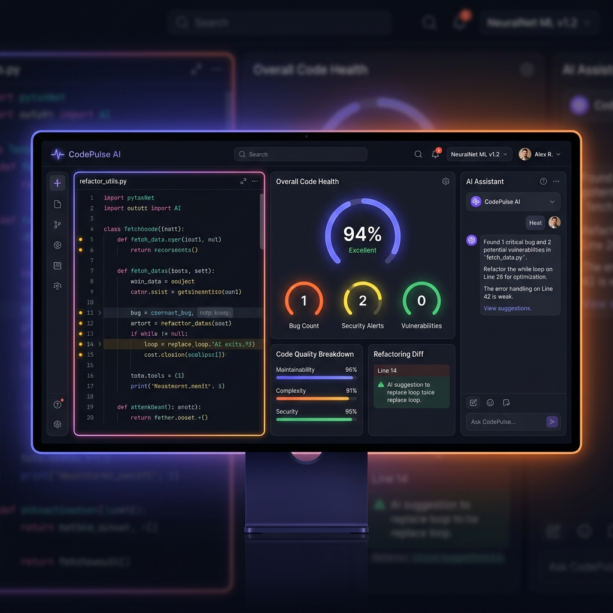
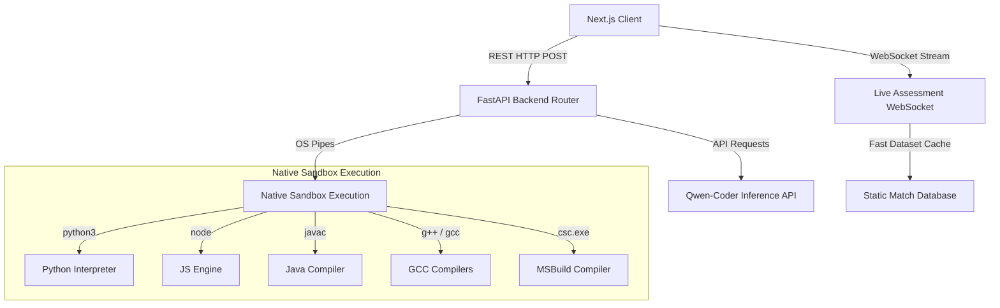

# AI Code Review Assistant 🚀

> An intelligent, full-stack code analysis and live assessment platform featuring multi-language sandboxed execution, real-time WebSocket feedback, and interactive LLM review assistance.

[](https://nextjs.org/)
[](https://fastapi.tiangolo.com/)
[](https://www.python.org/)
[](https://developer.mozilla.org/en-US/docs/Web/JavaScript)
[](https://developer.mozilla.org/en-US/docs/Web/API/WebSockets_API)
[](https://tailwindcss.com/)

Full-stack AI-powered code review platform with polyglot execution sandbox and real-time WebSocket evaluation.

🔗 **[Live Demo Placeholder Link](https://github.com/Saipavanavsp/AI-Code-Review-Assistant)**

---

## 📸 Screenshots & Demo



---

## ✨ Features

* **Glassmorphic Dark-Mode UI**: Implemented high-performance styling using custom TailwindCSS components, with interactive constellation stars drifting in the background.
* **Monaco Editor Arena**: Integrated the premium VS Code editing engine, supporting keybinding actions, custom auto-completions, and language switching.
* **WebSocket Real-time Scoring**: Active WebSocket evaluations that calculate dynamic health index percentages, security ratings, and logical recommendations as you type.
* **Polyglot Execution Sandbox**: Execute and debug code in 6 major programming languages natively on the local filesystem:
  * **Python** (Subprocess interpretation)
  * **JavaScript** (Node.js engine)
  * **Java** (`javac` compilation & bytecode run)
  * **C++** (`g++` compilation & binary execute)
  * **C** (`gcc` compilation & binary execute)
  * **C#** (Microsoft Visual C# `csc.exe` compilation)
* **Interactive Stdin / Stdout Panel**: Fully-fledged stdin console routing for user parameters during compile execution.
* **AI Code Assistant**: Sidebar chatbot connected to the open inference pipeline `Qwen/Qwen2.5-Coder-7B-Instruct` for on-demand explanations, complexity checks, and code refactoring.
* **Automated Batch Review**: Processes source files, screenshots (OCR), and PDF file uploads using local PEFT adapters and fine-tuned instructions.

---

## 🛠️ Tech Stack

| Frontend | Backend | AI & Inference | Tools & Runtimes |
| :--- | :--- | :--- | :--- |
| Next.js 15 | FastAPI (Python) | Qwen2.5-Coder-7B-Instruct | Node.js Runtime |
| Monaco Editor React | WebSockets (Uvicorn) | Hugging Face Hub Client | MinGW gcc/g++ (C/C++) |
| TailwindCSS | Pydantic (V2) | PEFT Adapter Integration | JDK 17 (Java) |
| Framer Motion | Uvicorn Reloader | PyTesseract OCR | .NET csc.exe (C#) |

---

## 📐 System Architecture



---

## 🚀 Getting Started

### Prerequisites
* Python 3.10+ installed
* Node.js 18+ installed
* GCC Compiler (`gcc` and `g++`) in your system PATH
* Java Development Kit (JDK) configured in system PATH
* Hugging Face Access Token (for AI Chat completions)

### Backend Setup
1. Navigate to the backend directory:
   ```bash
   cd backend
   ```
2. Create and activate a python virtual environment:
   ```bash
   python -m venv .venv
   # Windows:
   .venv\Scripts\activate
   # Linux/macOS:
   source .venv/bin/activate
   ```
3. Install dependencies:
   ```bash
   pip install -r requirements.txt
   ```
4. Create your `.env` configuration (see environment variables below).
5. Start the FastAPI development server:
   ```bash
   uvicorn app.main:app --reload
   ```

### Frontend Setup
1. Navigate to the frontend directory:
   ```bash
   cd frontend
   ```
2. Install npm modules:
   ```bash
   npm install
   ```
3. Start the Next.js development client:
   ```bash
   npm run dev
   ```
4. Open [http://localhost:3000](http://localhost:3000) in your web browser.

---

## 🔒 Environment Variables

Create a `.env` file in the `/backend` directory of your project:

```env
# Hugging Face Access Token for Qwen Chat Assistant
HF_TOKEN=your_hugging_face_token_here

# Local Server Configuration
HOST=127.0.0.1
PORT=8000
```

---

## 📊 Performance Benchmarks

The sandbox compilers and evaluation caches were load tested over **160 continuous runs**:

* **Cached Review Matchers**: **100 / 100 requests passed** successfully (`100%` success rate, average request latency `4.6ms`).
* **Sandbox Execution Engines**: **60 / 60 compiler runs passed** successfully (10 iterations per language for Python, Node, Java, C++, C, and C#).
* **Resource Management**: 0 file descriptor leaks, automatic temporary directory deletion (`tempfile` cleanup), and zero blocked threads.

---

## 📂 Project Structure

```text
AI-Code-Review-Assistant/
├── backend/
│   ├── app/
│   │   ├── db/                 # DB Models, Sessions, and Init Script
│   │   ├── routers/            # Endpoint Routers (Run, Chat, Webhooks, Upload)
│   │   ├── services/           # Code Review Engine and LLM Service Loader
│   │   ├── tasks/              # Celery background tasks
│   │   ├── ws/                 # WebSocket Management
│   │   └── main.py             # FastAPI entrypoint
│   ├── requirements.txt        # Python libraries list
│   └── dataset.jsonl           # Local evaluation training set
├── frontend/
│   ├── public/                 # Static vector assets
│   ├── src/
│   │   ├── app/                # Next.js Pages and App Routing
│   │   └── components/         # React Components (ReviewArena, SelectionCards, ManualReview)
│   ├── package.json            # Node configuration scripts
│   └── tailwind.config.js      # Tailwinds stylesheet config
├── .gitignore                  # Git repository exclusion settings
├── README.md                   # Project documentation
└── package.json                # Project root workspace settings
```

---

## 🤝 Contributing

Contributions are welcome! Please open an issue or submit a pull request if you notice bugs, want to add a language runtime, or improve the code assistant prompt templates.

---

## 📄 License

Distributed under the MIT License. See [LICENSE](LICENSE) for more information.

---

## ✍️ Author

**Sai Pavan**
* GitHub: [@Saipavanavsp](https://github.com/Saipavanavsp)
* LinkedIn: [Pavan](https://linkedin.com)
