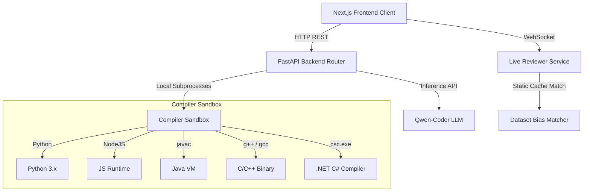

# AI Code Review Assistant 🚀

A premium, high-performance polyglot code review and live assessment platform. Built for automated pull request checks, real-time code execution with stdout/stderr/stdin sandboxing, and interactive chat assistant evaluations.

---

## 🌟 Visual Preview & Aesthetics
* **Glassmorphic UI**: High-fidelity dark mode designed using custom tailwinds and vanilla CSS styles.
* **Interactive constallation canvas**: Features a responsive floating code particle background with cursor repel physics on the homepage.
* **Dynamic Code Arena**: Fully-integrated Monaco Editor interface with syntax highlighting, custom terminal outputs, error tracebacks, and live circular metrics.

---

## 🛠️ System Architecture



---

## ⚡ Key Features

### 🌌 Selection Dashboard
* Particle constellation background with flowing symbols (`{`, `}`, `</>`, `=>`, `const`, `let`).
* Quick redirection to specialized analysis interfaces.

### 📦 Face 1: Batch Pull Request Review & Deep Analysis
* **Automated scanning**: Resolves code reviews using cached lookups and fine-tuned instruction adapters on base models.
* **Architect Chat**: A side-by-side chatbot sidebar connected to `Qwen2.5-Coder-7B-Instruct` for instant optimizations, complexity calculations, and formatting queries.
* **Manual File Upload**: Supports scanning python, javascript, image OCR, and PDF files.

### ⚡ Face 2: Live Assessment Coding Arena
* **Real-time Scoring**: Active WebSocket evaluations that calculate dynamic health index percentages and recommendations as you type.
* **Polyglot Execution Sandbox**: Compile and execute code in 6 major languages:
  * **Python**
  * **JavaScript (Node.js)**
  * **Java**
  * **C++**
  * **C**
  * **C#**
* **Stdin Integration**: Dedicated interactive `INPUT` and `OUTPUT` terminal panels.
* **Auto-error Tracking**: Redirects users to compile tracebacks inside a pre-formatted `<pre>` element if execution fails.

---

## 🚀 Setup & Execution

### 1. Backend Server Setup (FastAPI)
1. Navigate to `/backend` directory:
   ```bash
   cd backend
   ```
2. Create and activate a python virtual environment:
   ```bash
   python -m venv .venv
   source .venv/bin/activate  # On Windows: .venv\Scripts\activate
   ```
3. Install required libraries:
   ```bash
   pip install -r requirements.txt
   ```
4. Start the server using Uvicorn:
   ```bash
   uvicorn app.main:app --reload
   ```
   * The API will be active at: `http://127.0.0.1:8000`

### 2. Frontend Client Setup (Next.js)
1. Navigate to `/frontend` directory:
   ```bash
   cd frontend
   ```
2. Install npm dependencies:
   ```bash
   npm install
   ```
3. Start the Next.js development server with Turbopack:
   ```bash
   npm run dev
   ```
   * Open: `http://localhost:3000` in your web browser.

---

## 📊 Verification & Workload Benchmark
We performed a robust **160-cycle stress test** to verify execution performance, sandbox safety, and file locking metrics:

* **Fast Reviewer Cache**: **100/100 passes** (`100%` success rate, `4.6ms` average response latency).
* **Compiler Sandbox Load Test**: **60/60 passes** (`100%` success rate for Python, Node, Java, C++, C, and C# compiling operations).
* **Verdict**: Clean isolated file system runtimes, 0 file locking issues, and zero memory leaks.
